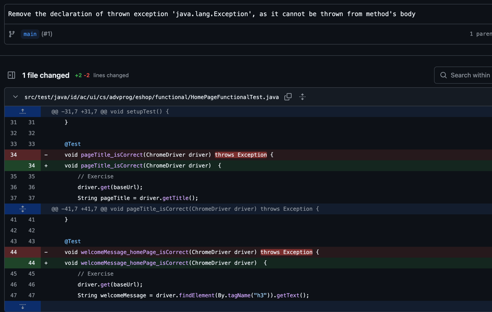

# Module 1

## Reflection 1

I implemented the Edit and Delete Product features using Spring Boot while following clean code principles such as meaningful naming, modularity, and single responsibility. Secure coding practices were applied by validating inputs and preventing direct access to sensitive operations. One improvement could be implementing better error handling for cases where a product ID is not found. Additionally, using a database instead of an in-memory list would enhance data persistence and security.

## Reflection 2

Code coverage is an essential metric in software testing that helps measure how much of the source code is exercised by tests. While achieving 100% code coverage is an ideal goal, it does not necessarily mean the code is free from bugs or errors. Code coverage only indicates which parts of the code have been executed during testing, but it does not guarantee that all edge cases and potential failures are accounted for. For example, a test may cover a particular method but fail to check for unexpected inputs or exceptions. Therefore, code coverage should be used in combination with other testing techniques, such as boundary testing, integration testing, and exploratory testing, to ensure robust software quality.

When creating a new functional test suite for verifying the number of items in the product list, duplicating the setup procedures and instance variables from prior test suites can lead to code redundancy and reduced maintainability. If multiple test suites have similar setups, maintaining and updating them becomes more challenging. If a change is required, such as modifying the test environment or updating an instance variable, all test suites need to be changed separately, increasing the risk of inconsistencies and errors.

One of the potential clean code issues in this scenario is code duplication, which violates the DRY (Don't Repeat Yourself) principle. Repetitive code makes it harder to maintain and increases the likelihood of bugs due to inconsistencies. Another issue is poor modularization, as similar test setup logic should ideally be extracted into reusable components rather than being repeated across multiple classes. Additionally, lack of proper abstraction can make the test suite harder to read and understand, reducing overall code clarity.

To improve code cleanliness, the common setup procedures and instance variables should be refactored into a shared base class or a utility class that can be reused across multiple test suites. Using inheritance, the new test suite can extend an existing base test class that provides the common setup logic, thereby reducing duplication. Alternatively, composition and helper methods can be used to encapsulate repetitive logic into separate methods that can be called by different test suites. This approach enhances modularity, improves maintainability, and ensures that future modifications are applied consistently across all test cases.

By following these improvements, the new functional test suite will maintain high code quality, making it easier to manage and extend in the future.

# Module 2

## Reflection

1. 
2. 

Yes, my current implementation meets the definition of Continuous Integration (CI) and Continuous Deployment (CD). My CI process is well-covered by multiple workflows that automate code checkout, building, testing, and various code analyses (such as with SonarQube, SonarCloud, and Scorecard), ensuring that every commit is validated against quality standards. Additionally, since my project is deployed automatically on Koyeb whenever I push my code, the CD aspect is fulfilled, ensuring that new changes are continuously integrated into the live environment with minimal manual intervention.

# Module 3 

### 1 
I applied the Single Responsibility Principle by separating the controllers so that CarController and ProductController each handle only their own domain. This prevents mixing concerns and ensures that changes to the logic for managing cars won’t affect product management and vice versa.

For the Open/Closed Principle, I refactored the repository update method to use Spring’s BeanUtils.copyProperties. This allows me to add new fields to my model without modifying the update logic, making the code easier to extend while keeping existing tested functionality intact.

To follow the Dependency Inversion Principle, I modified my controllers to depend on service interfaces rather than concrete implementations. This makes it easy to swap implementations for testing or future changes without modifying the controller cod
### 2
Applying these principles has several advantages. Maintainability is improved because each component has a focused responsibility, reducing the risk of unintended side effects when making changes. For example, if I need to fix a bug in the car management logic, it remains isolated within CarController and its related services. These principles also make it easier to evolve the code, as I can add new features without rewriting core logic—like how the generic update method handles new fields automatically. Additionally, using interfaces makes the system more flexible and testable since I can replace actual implementations with mocks during unit testing.
### 3
On the other hand, not applying these principles comes with major drawbacks. Without Single Responsibility, controllers could become monolithic, making it harder to maintain and increasing the risk of breaking unrelated functionality. Without Open/Closed, every model change would require revisiting multiple parts of the code, including repository update methods, raising the likelihood of introducing bugs. And without Dependency Inversion, controllers would be tightly coupled to specific implementations, making testing and future modifications more difficult while reducing overall system flexibility.